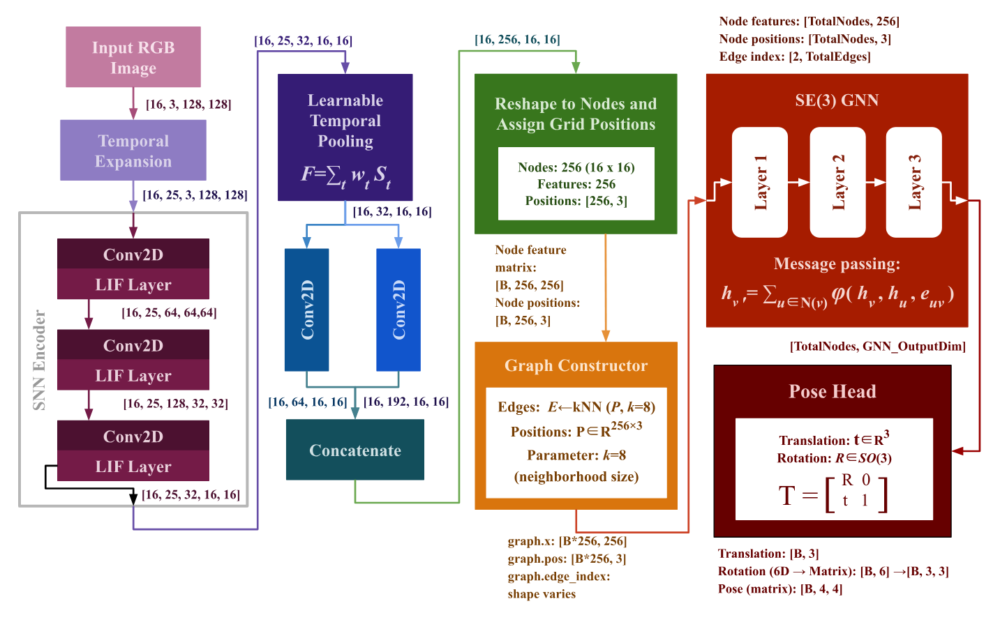

# SGSPose: Neuromorphic-Geometric 6D Pose Estimation

**SGSPose** is a novel deep learning architecture for robust and energy-efficient 6D pose estimation, combining **spiking neural networks (SNNs)**, **graph neural networks (GNNs)**, and **SE(3)-equivariant** geometric reasoning. This method achieves state-of-the-art translation accuracy on the 7Scenes benchmark while maintaining computational efficiency through neuromorphic processing. This work is accepted at IEEE Access.

## Key Features

- **Spiking Neural Networks (SNNs)**: Event-driven, energy-efficient feature encoding with temporal spike processing
- **Graph Neural Networks (GNNs)**: Relational reasoning through spatial graph construction and message passing
- **SE(3)-Equivariant Learning**: Geometric consistency through Lie algebra-based optimization for rigid body transformations
- **Direct 6D Pose Regression**: Outputs 3D translation and 6D rotation representations with orthogonalization
- **State-of-the-Art Performance**: >90% improvement in translation accuracy on 7Scenes compared to PoseNet, with 6D pose predictions averaging <0.06m translation error

## Performance Summary

SGSPose achieves exceptional translation accuracy across the 7Scenes dataset:

| Scene | Translation Error (m) | Rotation Error (°) | ADD-S Acc@0.5 |
|-------|----------------------|-------------------|---------------|
| Chess | 0.019 | 8.3 | 0.962 |
| Office | 0.047 | 12.4 | 0.680 |
| Pumpkin | 0.049 | 9.1 | 0.687 |
| Red Kitchen | 0.059 | 13.6 | 0.599 |
| Fire | 0.039 | 21.3 | 0.774 |
| Stairs | 0.055 | 13.7 | 0.739 |

## System Requirements

- **Python**: 3.9+
- **CUDA**: 11.8+ (for GPU acceleration)
- **GPU Memory**: Minimum 8GB (tested on Tesla T4)
- **PyTorch**: 2.1.0 with CUDA support

## Installation

### 1. Clone the Repository

```bash
git clone https://github.com/Janhavi-118/SGSPose.git
cd SGSPose
```

### 2. Create Python Environment

```bash
python3 -m venv venv
source venv/bin/activate  # On Windows: venv\Scripts\activate
```

### 3. Install Dependencies

```bash
pip install -r requirements.txt
```

### Core Dependencies Installed:
- `torch==2.1.0` with CUDA 11.8
- `torchvision` and `torchaudio`
- `snntorch==0.9.4` (Spiking Neural Networks)
- `e3nn==0.5.0` (Equivariant Neural Networks)
- `torch-geometric` (Graph Neural Networks)
- `torch-scatter` (Scatter operations for GNNs)
- `kornia` (Geometric computer vision)
- `SimpleITK` (Medical image processing for TSDF)
- `open3d` (3D data processing)
- `numpy==1.24.4` (NumPy compatible with PyTorch 2.1.0)

## Dataset Preparation

### 7Scenes Dataset

1. **Download** the 7Scenes dataset from the [official source](https://www.microsoft.com/en-us/research/project/rgb-d-dataset-7-scenes/)

2. **Organize** the directory structure as follows:

```
/path/to/7scenes/
├── chess/
│   ├── seq-01/
│   │   ├── frame-000000.color.png
│   │   ├── frame-000000.pose.txt
│   │   └── ...
│   ├── TrainSplit.txt
│   └── TestSplit.txt
├── office/
├── pumpkin/
├── red_kitchen/
├── fire/
└── stairs/
```

3. **TSDF Conversion** (if using 3D scene geometry):
   - The notebook includes utilities to convert `.mhd` (TSDF volume) files to point clouds using `SimpleITK` and `open3d`
   - See the `tsdf_to_pointcloud()` function in the notebook for details

4. **Update Paths** in the notebook or configuration files to point to your 7Scenes data location

## Usage

### Running the Notebook

Open and run the provided Jupyter notebook:

```bash
jupyter notebook SGSPose.ipynb
```

The notebook includes:
- Environment setup and dependency verification
- Dataset loading and preprocessing
- Model architecture definitions (SNN encoder, GNN layers, SE(3)-equivariant reasoning)
- Training loop with gradient accumulation and mixed precision
- Evaluation on validation/test splits
- Visualization of results and error analysis

### Notebook Structure

1. **Setup & Dependencies**
   - PyTorch and GPU verification
   - Installation of specialized libraries (snntorch, e3nn, torch-geometric)

2. **Data Loading**
   - Google Drive integration for dataset access
   - Sequence parsing and augmentation
   - Train/validation/test split management

3. **Model Components**
   - `SNNEncoder`: Leaky integrate-and-fire neurons with learnable thresholds
   - `SpikeToGeometric`: Conversion to scalar/vector features
   - `GraphConstructor`: K-NN and spatial graph building
   - `SE3EquivariantGNN`: Lie algebra-based message passing
   - `NeuromorphicLieGNN`: Full pipeline integration

4. **Training**
   - CompositelossFunction: Position + Rotation + ADD-S losses with adaptive EMA weighting
   - Gradient accumulation (4 steps) for memory efficiency
   - GradScaler for mixed precision training
   - Learning rate scheduling per parameter group

5. **Evaluation**
   - Per-scene metrics: translation error, rotation error, ADD-S accuracy
   - Inference with 6D-to-SO(3) orthogonalization

## Key Implementation Details

### Architecture Overview



The SGSPose pipeline combines event-driven neuromorphic encoding with geometric reasoning for robust 6D pose estimation. Input RGB images are processed through spiking neurons to extract efficient temporal features, which are then structured into spatial graphs and refined through SE(3)-equivariant message passing to produce both translation and rotation estimates.

```
Input Image (RGB, 128×128)
    ↓
[SNN Encoder] → Spike trains (T=32 timesteps)
    ↓
[Temporal Pooling] → Rate-based representation
    ↓
[Spike-to-Geometric] → Scalar (64×16×16) + Vector (64×16×16×3) features
    ↓
[Graph Construction] → K-NN spatial graph (256 nodes, 8 neighbors)
    ↓
[SE(3)-Equivariant GNN] → Node embeddings with geometric reasoning
    ↓
[Pose Regression] → Translation (R³) + Rotation (6D representation)
    ↓
[Orthogonalization] → SO(3) rotation matrix (inference only)
    ↓
6D Pose Output [t, R]
```

### Key Hyperparameters

- **Training Epochs**: 200
- **Batch Size**: 16
- **SNN Timesteps**: 32
- **LIF Neuron Decay (β)**: 0.72–0.85 per layer
- **Learning Rates**:
  - Rotation parameters: 1e-4
  - Translation parameters: 3e-4
  - Others: 2e-4
- **Gradient Clipping**: 1.0
- **Gradient Accumulation**: 4 steps

### Loss Function Components

1. **Position Loss**: Smooth L1 between predicted and ground-truth translation
2. **Rotation Loss**: Geodesic distance in SO(3) space
3. **ADD-S Loss**: Average 3D distance of scene points after transformation
4. **Adaptive Weighting**: Exponential moving average (EMA) balancing

## Configuration

A sample `configs/default.yaml` (not included but suggested structure):

```yaml
# Model Configuration
model:
  snn_steps: 32
  snn_beta: 0.5
  gnn_layers: 3
  graph_k_neighbors: 8

# Training Configuration
training:
  epochs: 200
  batch_size: 16
  lr_translation: 3e-4
  lr_rotation: 1e-4
  lr_others: 2e-4
  grad_clip: 1.0
  accumulation_steps: 4

# Data Configuration
data:
  input_size: [128, 128]
  dataset_root: "/path/to/7scenes"
  val_test_split_ratio: 0.5

# Device Configuration
device: "cuda"  # or "cpu"
```

## Important Notes

- **Scene-Specific Training**: The current implementation requires full training for each scene (not few-shot). Transfer learning across scenes is not yet implemented.
- **Rotation Performance**: While translation accuracy is state-of-the-art, rotation estimation remains challenging in highly symmetric scenes (e.g., Fire). Consider specialized rotation augmentation for improvement.
- **GPU Memory**: Mixed precision training with gradient accumulation is used to fit batch size 16 on 8GB GPUs.
- **Training Plateau**: The model typically plateaus around epoch 63–80. Further learning rate reduction may not yield significant gains for rotation.

## Troubleshooting

### NaN Errors During Training
- Check data normalization (ensure pixel values in [0, 1])
- Verify gradient clipping is active
- Reduce learning rate if divergence occurs

### CUDA Out of Memory
- Reduce batch size (e.g., 8 or 12)
- Reduce number of SNN timesteps (e.g., 16 instead of 32)
- Enable gradient checkpointing in SNN encoder

### Poor Rotation Accuracy
- Apply stronger rotation augmentation (±30° rotations)
- Ensure balanced dataset across viewpoints
- Consider pre-training on synthetic data with diverse orientations

## Citation

If you use SGSPose in your research, please cite:

```bibtex
@article{chaurasia2025sgspose,
  title={SGSPose: Neuromorphic-Geometric 6D Pose Estimation through Spiking Graph Neural Networks and SE(3)-Equivariant Learning},
  author={Chaurasia, Janhavi and Adyanthaya, Eshaan Rithesh and Prusty, Manas Ranjan},
  journal={IEEE Access},
  year={2025},
  note={Under review at IEEE Access}
}
```

## Authors

- **Janhavi Chaurasia** (janhavi.chaurasia2022@vitstudent.ac.in) — Vellore Institute of Technology, Chennai, India
- **Eshaan Rithesh Adyanthaya** (eshaan.rithesh2023@vitstudent.ac.in) — Vellore Institute of Technology, Chennai, India
- **Dr. Manas Ranjan Prusty** (manas.ranjan@vit.ac.in) — Vellore Institute of Technology, Chennai, India (Corresponding author)

## Acknowledgments

- 7Scenes dataset provided by Microsoft Research
- SNNs implemented with [snntorch](https://snntorch.readthedocs.io/)
- Equivariant networks powered by [e3nn](https://e3nn.org/)
- Graph neural networks built with [PyTorch Geometric](https://pytorch-geometric.readthedocs.io/)

## Related Work & References

For more context on the techniques used, refer to:
- PoseNet (Kendall et al., ICCV 2015)
- MapNet (Brahmbhatt et al., CVPR 2018)
- Spiking Neural Networks (SNNs) for 6D Pose (Courtois et al., 2024)
- SE(3)-Equivariant Networks (Thomas et al., 2018)
- Graph Neural Networks (GNNs) for Pose Estimation (Rezazadeh et al., 2023)

**Status**: Accepted at IEEE Access
